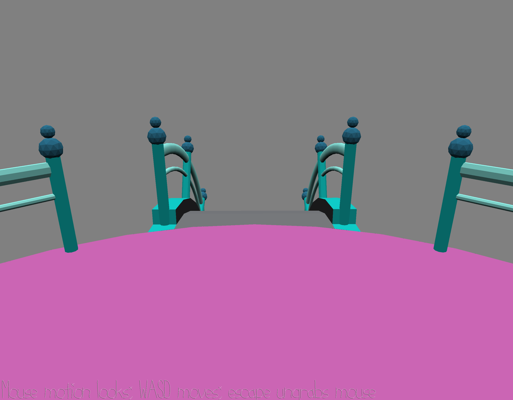

# Immobilized by Fear

Author: Eric Schneider

Design: In this game, you play a character who is deeply and tragically afraid
of teal railings. In fact, they're so afraid, they can't even move! All they
can do is look around and be scared of the cruel God that has put them in this
terrifying ring of railing-based horror.

To be honest, I had a pretty hefty week and did some poor planning. I figured
it was worth taking the day to reset my sleep schedule, since the grading allows
for one dropped small game. I'll be back on my A game next week--interview
season has been a real nightmare.

Screen Shot:

How To Play:

Controls are described on screen.

Sources: Assets provided by Jim McCann, as part of the base code.

This game was built with [NEST](NEST.md).

